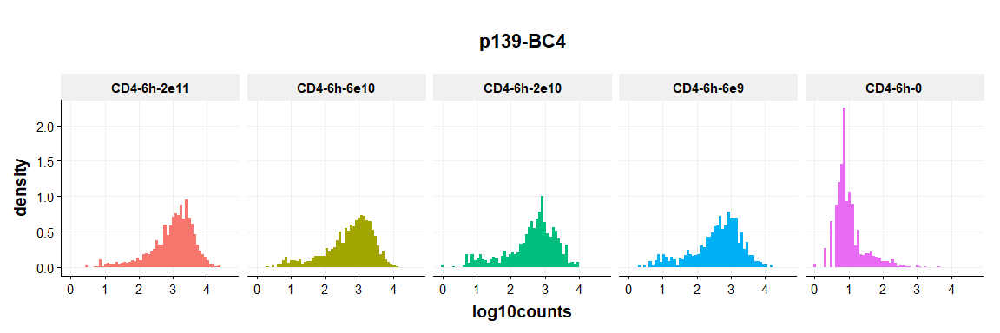
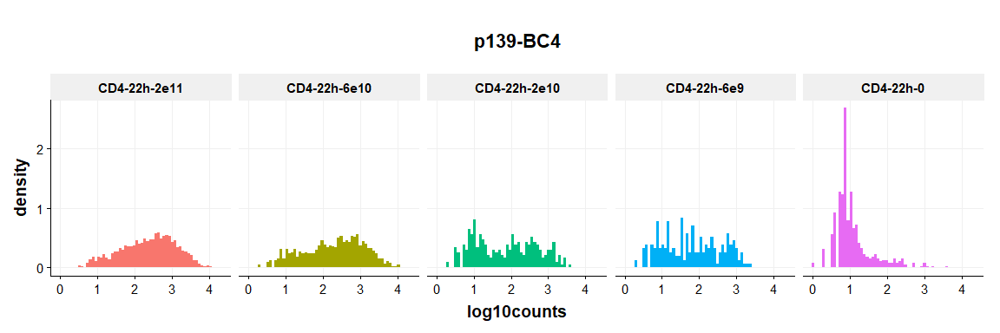
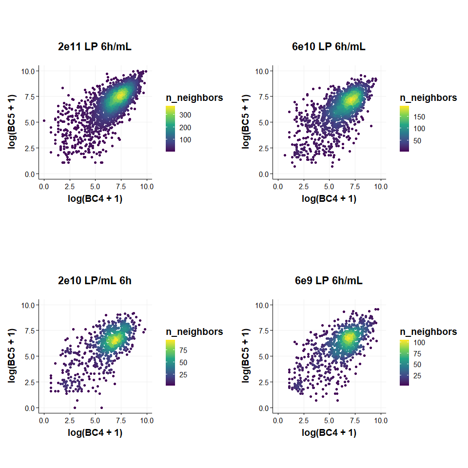
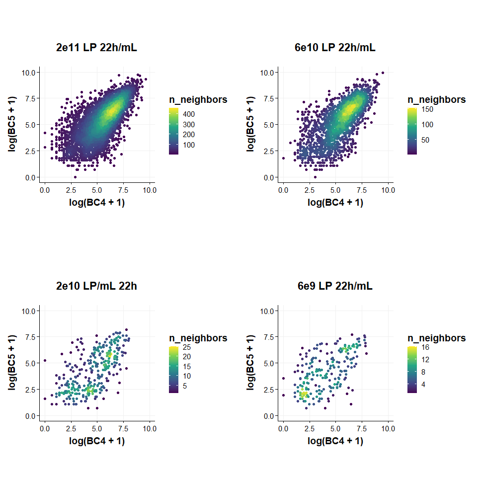
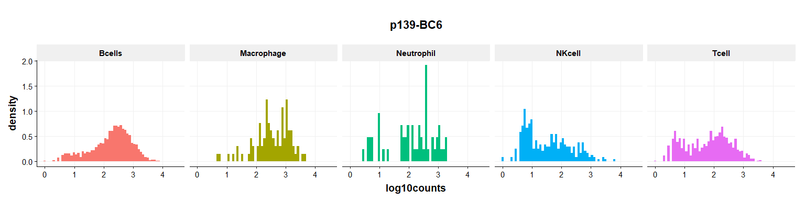

SIG03 oBC Direct Amp Barcode Analysis
================
Eric Y. Wang
2024-08-05

- [<u>Import Data</u>](#import-data)
- [<u>Visualize Barcode
  Distributions</u>](#visualize-barcode-distributions)
- [<u>Barcode Classification</u>](#barcode-classification)

``` r
source("functions/plotting_fxns.R")
source("functions/scRNA_seq_analysis_functions.R")
theme_set(theme_Publication())
```

    ## 
    ## Attaching package: 'ggthemes'

    ## The following object is masked from 'package:cowplot':
    ## 
    ##     theme_map

### <u>Import Data</u>

``` r
# dataCD4 <- readRDS("/Users/wange7/Library/CloudStorage/GoogleDrive-ericwang314@gmail.com/My Drive/Lab/datasets/EYW/SIG03_10x_240706/seurat_outs/SIG03_mouse_oBC_DirectAmp_CD4.rds")
# dataSplen <- readRDS("/Users/wange7/Library/CloudStorage/GoogleDrive-ericwang314@gmail.com/My Drive/Lab/datasets/EYW/SIG03_10x_240706/seurat_outs/SIG03_mouse_oBC_DirectAmp_splenocytes.rds")

dataCD4 <- readRDS("C:/Users/Eric/My Drive/Lab/datasets/EYW/SIG03_10x_240706/seurat_outs/SIG03_mouse_oBC_DirectAmp_CD4.rds")
dataSplen <- readRDS("C:/Users/Eric/My Drive/Lab/datasets/EYW/SIG03_10x_240706/seurat_outs/SIG03_mouse_oBC_DirectAmp_splenocytes.rds")
```

### <u>Visualize Barcode Distributions</u>

#### CD4 Barcodes

``` r
metadata <- dataCD4@meta.data %>%
  as_tibble(rownames = "cell_BC") %>%
  mutate(hash.ID = factor(hash.ID, c("CD4-6h-2e11","CD4-6h-6e10","CD4-6h-2e10","CD4-6h-6e9","CD4-6h-0",
                                     "CD4-22h-2e11","CD4-22h-6e10","CD4-22h-2e10","CD4-22h-6e9","CD4-22h-0",
                                     "Treg-4h")))

BCdata <- dataCD4@assays$BC@counts %>%
  as_tibble(rownames = "BC") %>%
  pivot_longer(-BC, names_to = "cell_BC", values_to = "counts") %>%
  mutate(log10counts = log10(counts + 1)) %>%
  left_join(metadata)
```

    ## Joining with `by = join_by(cell_BC)`

``` r
BCdata %>%
  filter(BC %in% c("p139-BC4")) %>%
    filter(hash.ID %in% c("CD4-6h-2e11","CD4-6h-6e10","CD4-6h-2e10","CD4-6h-6e9","CD4-6h-0")) %>%
  ggplot(aes(x = log10counts, fill = hash.ID)) +
    geom_histogram(aes(y = after_stat(density)), bins = 60) +
    facet_wrap(~hash.ID, ncol = 5) +
    NoLegend() +
    ggtitle("p139-BC4")
```

<!-- -->

``` r
BCdata %>%
  filter(BC %in% c("p139-BC5")) %>%
    filter(hash.ID %in% c("CD4-6h-2e11","CD4-6h-6e10","CD4-6h-2e10","CD4-6h-6e9","CD4-6h-0")) %>%
  ggplot(aes(x = log10counts, fill = hash.ID)) +
    geom_histogram(aes(y = after_stat(density)), bins = 60) +
    facet_wrap(~hash.ID, ncol = 5) +
    NoLegend() +
    ggtitle("p139-BC5")
```

<!-- -->

``` r
BCdata %>%
  filter(BC %in% c("p139-BC4")) %>%
    filter(hash.ID %in% c("CD4-22h-2e11","CD4-22h-6e10","CD4-22h-2e10","CD4-22h-6e9","CD4-22h-0")) %>%
  ggplot(aes(x = log10counts, fill = hash.ID)) +
    geom_histogram(aes(y = after_stat(density)), bins = 60) +
    facet_wrap(~hash.ID, ncol = 5) +
    NoLegend() +
    ggtitle("p139-BC4")
```

<!-- -->

``` r
BCdata %>%
  filter(BC %in% c("p139-BC5")) %>%
    filter(hash.ID %in% c("CD4-22h-2e11","CD4-22h-6e10","CD4-22h-2e10","CD4-22h-6e9","CD4-22h-0")) %>%
  ggplot(aes(x = log10counts, fill = hash.ID)) +
    geom_histogram(aes(y = after_stat(density)), bins = 60) +
    facet_wrap(~hash.ID, ncol = 5) +
    NoLegend() +
    ggtitle("p139-BC5")
```

<!-- -->

``` r
BCdata %>%
  filter(BC %in% c("p139-BC6")) %>%
  ggplot(aes(x = log10counts, fill = hash.ID)) +
    geom_histogram(aes(y = after_stat(density)), bins = 60) +
    geom_vline(xintercept = log10(100+1)) +
    facet_wrap(~hash.ID, ncol = 5) +
    NoLegend() +
    ggtitle("p139-BC6")
```

<!-- -->

``` r
dataCD4$hash.ID <- factor(dataCD4$hash.ID, c("CD4-6h-2e11","CD4-6h-6e10","CD4-6h-2e10","CD4-6h-6e9","CD4-6h-0",
                                     "CD4-22h-2e11","CD4-22h-6e10","CD4-22h-2e10","CD4-22h-6e9","CD4-22h-0",
                                     "Treg-4h"))

VlnPlot(dataCD4, c("p139-BC4","p139-BC5","p139-BC6"), group.by = "hash.ID", pt.size = 0, assay = "BC")
```

<!-- -->

``` r
expressionData <- tibble(cell_bc = colnames(dataCD4),
                         hash.ID = dataCD4$hash.ID,
                         BC4 = dataCD4@assays$BC@counts["p139-BC5",],
                         BC5 = dataCD4@assays$BC@counts["p139-BC4",])

p1 <- expressionData %>%
  filter(hash.ID %in% c("CD4-6h-2e11")) %>%
  ggplot(aes(x = log10(BC4 + 1), y = log10(BC5 + 1))) +
    geom_point() +
    stat_density2d(aes(fill = ..level..), geom = "polygon") +
    scale_fill_viridis_c() +
    theme(aspect.ratio = 1) +
    ggtitle("2e11 LP 6h/mL\nSCT normalized Expression")

p2 <- expressionData %>%
  filter(hash.ID %in% c("CD4-6h-6e10")) %>%
  ggplot(aes(x = log10(BC4 + 1), y = log10(BC5 + 1))) +
    geom_point() +
    stat_density2d(aes(fill = ..level..), geom = "polygon") +
    scale_fill_viridis_c() +
    theme(aspect.ratio = 1) +
    ggtitle("6e10 LP 6h/mL\nSCT normalized Expression")

p3 <- expressionData %>%
  filter(hash.ID %in% c("CD4-6h-2e10")) %>%
  ggplot(aes(x = log10(BC4 + 1), y = log10(BC5 + 1))) +
    geom_point() +
    stat_density2d(aes(fill = ..level..), geom = "polygon") +
    scale_fill_viridis_c() +
    theme(aspect.ratio = 1) +
    ggtitle("2e10 LP/mL 6h\nSCT normalized Expression")

p4 <- expressionData %>%
  filter(hash.ID %in% c("CD4-6h-6e9")) %>%
  ggplot(aes(x = log10(BC4 + 1), y = log10(BC5 + 1))) +
    geom_point() +
    stat_density2d(aes(fill = ..level..), geom = "polygon") +
    scale_fill_viridis_c() +
    theme(aspect.ratio = 1) +
    ggtitle("6e9 LP 6h/mL\nSCT normalized Expression")

plot_grid(p1,p2,p3,p4, ncol = 2)
```

    ## Warning: The dot-dot notation (`..level..`) was deprecated in ggplot2 3.4.0.
    ## ℹ Please use `after_stat(level)` instead.
    ## This warning is displayed once every 8 hours.
    ## Call `lifecycle::last_lifecycle_warnings()` to see where this warning was
    ## generated.

<!-- -->

``` r
expressionData <- tibble(cell_bc = colnames(dataCD4),
                         hash.ID = dataCD4$hash.ID,
                         BC4 = dataCD4@assays$BC@data["p139-BC5",],
                         BC5 = dataCD4@assays$BC@data["p139-BC4",])

p1 <- expressionData %>%
  filter(hash.ID %in% c("CD4-22h-2e11")) %>%
  ggplot(aes(x = log10(BC4 + 1), y = log10(BC5 + 1))) +
    geom_point() +
    stat_density2d(aes(fill = ..level..), geom = "polygon") +
    scale_fill_viridis_c() +
    theme(aspect.ratio = 1) +
    ggtitle("2e11 LP 22h/mL\nSCT normalized Expression")

p2 <- expressionData %>%
  filter(hash.ID %in% c("CD4-22h-6e10")) %>%
  ggplot(aes(x = log10(BC4 + 1), y = log10(BC5 + 1))) +
    geom_point() +
    stat_density2d(aes(fill = ..level..), geom = "polygon") +
    scale_fill_viridis_c() +
    theme(aspect.ratio = 1) +
    ggtitle("6e10 LP 22h/mL\nSCT normalized Expression")

p3 <- expressionData %>%
  filter(hash.ID %in% c("CD4-22h-2e10")) %>%
  ggplot(aes(x = log10(BC4 + 1), y = log10(BC5 + 1))) +
    geom_point() +
    stat_density2d(aes(fill = ..level..), geom = "polygon") +
    scale_fill_viridis_c() +
    theme(aspect.ratio = 1) +
    ggtitle("2e10 LP/mL 22h\nSCT normalized Expression")

p4 <- expressionData %>%
  filter(hash.ID %in% c("CD4-22h-6e9")) %>%
  ggplot(aes(x = log10(BC4 + 1), y = log10(BC5 + 1))) +
    geom_point() +
    stat_density2d(aes(fill = ..level..), geom = "polygon") +
    scale_fill_viridis_c() +
    theme(aspect.ratio = 1) +
    ggtitle("6e9 LP 22h/mL\nSCT normalized Expression")

plot_grid(p1,p2,p3,p4, ncol = 2)
```

<!-- -->

#### Splenocyte Barcodes

``` r
metadata <- dataSplen@meta.data %>%
  as_tibble(rownames = "cell_BC")

BCdata <- dataSplen@assays$BC@counts %>%
  as_tibble(rownames = "BC") %>%
  pivot_longer(-BC, names_to = "cell_BC", values_to = "counts") %>%
  mutate(log10counts = log10(counts + 1)) %>%
  left_join(metadata)
```

    ## Joining with `by = join_by(cell_BC)`

``` r
BCdata %>%
  filter(BC %in% c("p139-BC6")) %>%
  ggplot(aes(x = log10counts, fill = clusters_anno)) +
    geom_histogram(aes(y = after_stat(density)), bins = 60) +
    geom_vline(xintercept = log10(100+1)) +
    facet_wrap(~clusters_anno) +
    NoLegend() +
    ggtitle("p139-BC6")
```

<!-- -->

``` r
BCdata %>%
  filter(BC %in% c("p139-BC6")) %>%
  filter(!(clusters_anno %in% c("6_8","10"))) %>%
  ggplot(aes(x = log10counts, fill = clusters_anno)) +
    geom_histogram(aes(y = after_stat(density)), bins = 60) +
    facet_wrap(~clusters_anno, ncol = 5) +
    NoLegend() +
    ggtitle("p139-BC6")
```

<!-- -->

``` r
VlnPlot(dataSplen, "p139-BC6", pt.size = 0, assay = "BC")
```

<!-- -->

``` r
VlnPlot(subset(dataSplen, !(subset = clusters_anno %in% c("6_8","10"))), "p139-BC6", pt.size = 0, assay = "BC")
```

<!-- -->

### <u>Barcode Classification</u>

``` r
data6hCD4 <- subset(dataCD4, subset = hash.ID %in% c("CD4-6h-2e11","CD4-6h-6e10","CD4-6h-2e10","CD4-6h-6e9","CD4-6h-0"))
data22hCD4 <- subset(dataCD4, subset = hash.ID %in% c("CD4-22h-2e11","CD4-22h-6e10","CD4-22h-2e10","CD4-22h-6e9","CD4-22h-0"))
```

#### Barcode 4 Recall

Create test datasets for 6h

``` r
testDataList <- vector(mode = "list")

testDataList[["CD4-6h-2e11"]] <- tibble(hash.ID = dataCD4$hash.ID,
                   umi_counts = dataCD4@assays$BC@counts["p139-BC4",]) %>%
  filter(hash.ID %in% c("CD4-6h-2e11","CD4-6h-0")) %>%
  mutate(label = case_when(hash.ID == "CD4-6h-0" ~ "negative",
                           hash.ID %in% c("CD4-6h-2e11","CD4-6h-6e10","CD4-6h-2e10","CD4-6h-6e9") ~ "positive")) %>%
  mutate(label = factor(label, c("positive","negative")))

testDataList[["CD4-6h-6e10"]] <- tibble(hash.ID = dataCD4$hash.ID,
                   umi_counts = dataCD4@assays$BC@counts["p139-BC4",]) %>%
  filter(hash.ID %in% c("CD4-6h-6e10","CD4-6h-0")) %>%
  mutate(label = case_when(hash.ID == "CD4-6h-0" ~ "negative",
                           hash.ID %in% c("CD4-6h-2e11","CD4-6h-6e10","CD4-6h-2e10","CD4-6h-6e9") ~ "positive")) %>%
  mutate(label = factor(label, c("positive","negative")))

testDataList[["CD4-6h-2e10"]] <- tibble(hash.ID = dataCD4$hash.ID,
                   umi_counts = dataCD4@assays$BC@counts["p139-BC4",]) %>%
  filter(hash.ID %in% c("CD4-6h-2e10","CD4-6h-0")) %>%
  mutate(label = case_when(hash.ID == "CD4-6h-0" ~ "negative",
                           hash.ID %in% c("CD4-6h-2e11","CD4-6h-6e10","CD4-6h-2e10","CD4-6h-6e9") ~ "positive")) %>%
  mutate(label = factor(label, c("positive","negative")))

testDataList[["CD4-6h-6e9"]] <- tibble(hash.ID = dataCD4$hash.ID,
                   umi_counts = dataCD4@assays$BC@counts["p139-BC4",]) %>%
  filter(hash.ID %in% c("CD4-6h-6e9","CD4-6h-0")) %>%
  mutate(label = case_when(hash.ID == "CD4-6h-0" ~ "negative",
                           hash.ID %in% c("CD4-6h-2e11","CD4-6h-6e10","CD4-6h-2e10","CD4-6h-6e9") ~ "positive")) %>%
  mutate(label = factor(label, c("positive","negative")))
```

``` r
# Function to classify cells based on UMI count cutoff
classify_cells <- function(data, umi_cutoff) {
  data %>%
    mutate(predicted_label = ifelse(umi_counts >= umi_cutoff, "positive", "negative")) %>%
    mutate(predicted_label = factor(predicted_label, c("positive","negative")))
}

# range of UMI cutoffs to test
umi_cutoffs <- seq(0,1000, by = 1)

results <- tibble()
for(i in 1:length(testDataList)){
  temp <- map_df(umi_cutoffs, function(cutoff) {
  classified_data <- classify_cells(testDataList[[i]], cutoff)
  
  metrics <- classified_data %>%
    precision(truth = label, estimate = predicted_label) %>%
    bind_rows(
      classified_data %>%
        recall(truth = label, estimate = predicted_label),
      classified_data %>%
        sensitivity(truth = label, estimate = predicted_label),
      classified_data %>%
        specificity(truth = label, estimate = predicted_label),
    )
  metrics %>%
    mutate(umi_cutoff = cutoff)
  })
  # add category label to results
  temp <- mutate(temp, group = names(testDataList)[i])
  results <- bind_rows(results,temp)
}
write_csv(results, "analysis_outs/umi_cutoff_oBCDirect_metrics_BC4_6h.csv")

# plot PR curve
pr1 <- results %>%
  filter(.metric %in% c("precision", "recall")) %>%
  pivot_wider(names_from = .metric, values_from = .estimate) %>%
  mutate(group = factor(group, c("CD4-6h-2e11","CD4-6h-6e10","CD4-6h-2e10","CD4-6h-6e9"))) %>%
  ggplot(aes(x = recall, y = precision, color = group)) +
    geom_line(linewidth=1) +
    scale_color_brewer(palette = "Dark2") +
    labs(title = "PR Curve 6h BC4", x = "Recall", y = "Precision") +
    theme(aspect.ratio = 1) +
    xlim(0.5,1) +
    ylim(0.5,1)

# plot ROC
roc1 <- results %>%
  filter(.metric %in% c("sensitivity", "specificity")) %>%
  pivot_wider(names_from = .metric, values_from = .estimate) %>%
  mutate(FPR = 1-specificity) %>%
  mutate(group = factor(group, c("CD4-6h-2e11","CD4-6h-6e10","CD4-6h-2e10","CD4-6h-6e9"))) %>%
  ggplot(aes(x = FPR, y = sensitivity, color = group)) +
    geom_line(linewidth=1) +
    scale_color_brewer(palette = "Dark2") +
    labs(title = "ROC 6h BC4", x = "False Positive Rate", y = "True Positive Rate") +
    theme(aspect.ratio = 1) +
    xlim(0,1) +
    ylim(0,1)
```

Create test datasets for 22h

``` r
testDataList <- vector(mode = "list")

testDataList[["CD4-22h-2e11"]] <- tibble(hash.ID = dataCD4$hash.ID,
                   umi_counts = dataCD4@assays$BC@counts["p139-BC4",]) %>%
  filter(hash.ID %in% c("CD4-22h-2e11","CD4-22h-0")) %>%
  mutate(label = case_when(hash.ID == "CD4-22h-0" ~ "negative",
                           hash.ID %in% c("CD4-22h-2e11","CD4-22h-6e10","CD4-22h-2e10","CD4-22h-6e9") ~ "positive")) %>%
  mutate(label = factor(label, c("positive","negative")))

testDataList[["CD4-22h-6e10"]] <- tibble(hash.ID = dataCD4$hash.ID,
                   umi_counts = dataCD4@assays$BC@counts["p139-BC4",]) %>%
  filter(hash.ID %in% c("CD4-22h-6e10","CD4-22h-0")) %>%
  mutate(label = case_when(hash.ID == "CD4-22h-0" ~ "negative",
                           hash.ID %in% c("CD4-22h-2e11","CD4-22h-6e10","CD4-22h-2e10","CD4-22h-6e9") ~ "positive")) %>%
  mutate(label = factor(label, c("positive","negative")))

testDataList[["CD4-22h-2e10"]] <- tibble(hash.ID = dataCD4$hash.ID,
                   umi_counts = dataCD4@assays$BC@counts["p139-BC4",]) %>%
  filter(hash.ID %in% c("CD4-22h-2e10","CD4-22h-0")) %>%
  mutate(label = case_when(hash.ID == "CD4-22h-0" ~ "negative",
                           hash.ID %in% c("CD4-22h-2e11","CD4-22h-6e10","CD4-22h-2e10","CD4-22h-6e9") ~ "positive")) %>%
  mutate(label = factor(label, c("positive","negative")))

testDataList[["CD4-22h-6e9"]] <- tibble(hash.ID = dataCD4$hash.ID,
                   umi_counts = dataCD4@assays$BC@counts["p139-BC4",]) %>%
  filter(hash.ID %in% c("CD4-22h-6e9","CD4-22h-0")) %>%
  mutate(label = case_when(hash.ID == "CD4-22h-0" ~ "negative",
                           hash.ID %in% c("CD4-22h-2e11","CD4-22h-6e10","CD4-22h-2e10","CD4-22h-6e9") ~ "positive")) %>%
  mutate(label = factor(label, c("positive","negative")))
```

``` r
# Function to classify cells based on UMI count cutoff
classify_cells <- function(data, umi_cutoff) {
  data %>%
    mutate(predicted_label = ifelse(umi_counts >= umi_cutoff, "positive", "negative")) %>%
    mutate(predicted_label = factor(predicted_label, c("positive","negative")))
}

# range of UMI cutoffs to test
umi_cutoffs <- seq(0,1000, by = 1)

results <- tibble()
for(i in 1:length(testDataList)){
  temp <- map_df(umi_cutoffs, function(cutoff) {
  classified_data <- classify_cells(testDataList[[i]], cutoff)
  
  metrics <- classified_data %>%
    precision(truth = label, estimate = predicted_label) %>%
    bind_rows(
      classified_data %>%
        recall(truth = label, estimate = predicted_label),
      classified_data %>%
        sensitivity(truth = label, estimate = predicted_label),
      classified_data %>%
        specificity(truth = label, estimate = predicted_label),
    )
  metrics %>%
    mutate(umi_cutoff = cutoff)
  })
  # add category label to results
  temp <- mutate(temp, group = names(testDataList)[i])
  results <- bind_rows(results,temp)
}
write_csv(results, "analysis_outs/umi_cutoff_oBCDirect_metrics_BC4_22h.csv")

# plot PR curve
pr2 <- results %>%
  filter(.metric %in% c("precision", "recall")) %>%
  pivot_wider(names_from = .metric, values_from = .estimate) %>%
  mutate(group = factor(group, c("CD4-22h-2e11","CD4-22h-6e10","CD4-22h-2e10","CD4-22h-6e9"))) %>%
  ggplot(aes(x = recall, y = precision, color = group)) +
    geom_line(linewidth=1) +
    scale_color_brewer(palette = "Dark2") +
    labs(title = "PR Curve 22h BC4", x = "Recall", y = "Precision") +
    theme(aspect.ratio = 1) +
    xlim(0.5,1) +
    ylim(0.5,1)

# plot ROC
roc2 <- results %>%
  filter(.metric %in% c("sensitivity", "specificity")) %>%
  pivot_wider(names_from = .metric, values_from = .estimate) %>%
  mutate(FPR = 1-specificity) %>%
  mutate(group = factor(group, c("CD4-22h-2e11","CD4-22h-6e10","CD4-22h-2e10","CD4-22h-6e9"))) %>%
  ggplot(aes(x = FPR, y = sensitivity, color = group)) +
    geom_line(linewidth=1) +
    scale_color_brewer(palette = "Dark2") +
    labs(title = "ROC 22h BC4", x = "False Positive Rate", y = "True Positive Rate") +
    theme(aspect.ratio = 1) +
    xlim(0,1) +
    ylim(0,1)
```

#### Barcode 5 Recall

Create test datasets for 6h

``` r
testDataList <- vector(mode = "list")

testDataList[["CD4-6h-2e11"]] <- tibble(hash.ID = dataCD4$hash.ID,
                   umi_counts = dataCD4@assays$BC@counts["p139-BC5",]) %>%
  filter(hash.ID %in% c("CD4-6h-2e11","CD4-6h-0")) %>%
  mutate(label = case_when(hash.ID == "CD4-6h-0" ~ "negative",
                           hash.ID %in% c("CD4-6h-2e11","CD4-6h-6e10","CD4-6h-2e10","CD4-6h-6e9") ~ "positive")) %>%
  mutate(label = factor(label, c("positive","negative")))

testDataList[["CD4-6h-6e10"]] <- tibble(hash.ID = dataCD4$hash.ID,
                   umi_counts = dataCD4@assays$BC@counts["p139-BC5",]) %>%
  filter(hash.ID %in% c("CD4-6h-6e10","CD4-6h-0")) %>%
  mutate(label = case_when(hash.ID == "CD4-6h-0" ~ "negative",
                           hash.ID %in% c("CD4-6h-2e11","CD4-6h-6e10","CD4-6h-2e10","CD4-6h-6e9") ~ "positive")) %>%
  mutate(label = factor(label, c("positive","negative")))

testDataList[["CD4-6h-2e10"]] <- tibble(hash.ID = dataCD4$hash.ID,
                   umi_counts = dataCD4@assays$BC@counts["p139-BC5",]) %>%
  filter(hash.ID %in% c("CD4-6h-2e10","CD4-6h-0")) %>%
  mutate(label = case_when(hash.ID == "CD4-6h-0" ~ "negative",
                           hash.ID %in% c("CD4-6h-2e11","CD4-6h-6e10","CD4-6h-2e10","CD4-6h-6e9") ~ "positive")) %>%
  mutate(label = factor(label, c("positive","negative")))

testDataList[["CD4-6h-6e9"]] <- tibble(hash.ID = dataCD4$hash.ID,
                   umi_counts = dataCD4@assays$BC@counts["p139-BC5",]) %>%
  filter(hash.ID %in% c("CD4-6h-6e9","CD4-6h-0")) %>%
  mutate(label = case_when(hash.ID == "CD4-6h-0" ~ "negative",
                           hash.ID %in% c("CD4-6h-2e11","CD4-6h-6e10","CD4-6h-2e10","CD4-6h-6e9") ~ "positive")) %>%
  mutate(label = factor(label, c("positive","negative")))
```

``` r
# Function to classify cells based on UMI count cutoff
classify_cells <- function(data, umi_cutoff) {
  data %>%
    mutate(predicted_label = ifelse(umi_counts >= umi_cutoff, "positive", "negative")) %>%
    mutate(predicted_label = factor(predicted_label, c("positive","negative")))
}

# range of UMI cutoffs to test
umi_cutoffs <- seq(0,1000, by = 1)

results <- tibble()
for(i in 1:length(testDataList)){
  temp <- map_df(umi_cutoffs, function(cutoff) {
  classified_data <- classify_cells(testDataList[[i]], cutoff)
  
  metrics <- classified_data %>%
    precision(truth = label, estimate = predicted_label) %>%
    bind_rows(
      classified_data %>%
        recall(truth = label, estimate = predicted_label),
      classified_data %>%
        sensitivity(truth = label, estimate = predicted_label),
      classified_data %>%
        specificity(truth = label, estimate = predicted_label),
    )
  metrics %>%
    mutate(umi_cutoff = cutoff)
  })
  # add category label to results
  temp <- mutate(temp, group = names(testDataList)[i])
  results <- bind_rows(results,temp)
}
write_csv(results, "analysis_outs/umi_cutoff_oBCDirect_metrics_BC5_6h.csv")

# plot PR curve
pr3 <- results %>%
  filter(.metric %in% c("precision", "recall")) %>%
  pivot_wider(names_from = .metric, values_from = .estimate) %>%
  mutate(group = factor(group, c("CD4-6h-2e11","CD4-6h-6e10","CD4-6h-2e10","CD4-6h-6e9"))) %>%
  ggplot(aes(x = recall, y = precision, color = group)) +
    geom_line(linewidth=1) +
    scale_color_brewer(palette = "Dark2") +
    labs(title = "PR Curve 6h BC5", x = "Recall", y = "Precision") +
    theme(aspect.ratio = 1) +
    xlim(0.5,1) +
    ylim(0.5,1)

# plot ROC
roc3 <- results %>%
  filter(.metric %in% c("sensitivity", "specificity")) %>%
  pivot_wider(names_from = .metric, values_from = .estimate) %>%
  mutate(FPR = 1-specificity) %>%
  mutate(group = factor(group, c("CD4-6h-2e11","CD4-6h-6e10","CD4-6h-2e10","CD4-6h-6e9"))) %>%
  ggplot(aes(x = FPR, y = sensitivity, color = group)) +
    geom_line(linewidth=1) +
    scale_color_brewer(palette = "Dark2") +
    labs(title = "ROC 6h BC5", x = "False Positive Rate", y = "True Positive Rate") +
    theme(aspect.ratio = 1) +
    xlim(0,1) +
    ylim(0,1)
```

Create test datasets for 22h

``` r
testDataList <- vector(mode = "list")

testDataList[["CD4-22h-2e11"]] <- tibble(hash.ID = dataCD4$hash.ID,
                   umi_counts = dataCD4@assays$BC@counts["p139-BC5",]) %>%
  filter(hash.ID %in% c("CD4-22h-2e11","CD4-22h-0")) %>%
  mutate(label = case_when(hash.ID == "CD4-22h-0" ~ "negative",
                           hash.ID %in% c("CD4-22h-2e11","CD4-22h-6e10","CD4-22h-2e10","CD4-22h-6e9") ~ "positive")) %>%
  mutate(label = factor(label, c("positive","negative")))

testDataList[["CD4-22h-6e10"]] <- tibble(hash.ID = dataCD4$hash.ID,
                   umi_counts = dataCD4@assays$BC@counts["p139-BC5",]) %>%
  filter(hash.ID %in% c("CD4-22h-6e10","CD4-22h-0")) %>%
  mutate(label = case_when(hash.ID == "CD4-22h-0" ~ "negative",
                           hash.ID %in% c("CD4-22h-2e11","CD4-22h-6e10","CD4-22h-2e10","CD4-22h-6e9") ~ "positive")) %>%
  mutate(label = factor(label, c("positive","negative")))

testDataList[["CD4-22h-2e10"]] <- tibble(hash.ID = dataCD4$hash.ID,
                   umi_counts = dataCD4@assays$BC@counts["p139-BC5",]) %>%
  filter(hash.ID %in% c("CD4-22h-2e10","CD4-22h-0")) %>%
  mutate(label = case_when(hash.ID == "CD4-22h-0" ~ "negative",
                           hash.ID %in% c("CD4-22h-2e11","CD4-22h-6e10","CD4-22h-2e10","CD4-22h-6e9") ~ "positive")) %>%
  mutate(label = factor(label, c("positive","negative")))

testDataList[["CD4-22h-6e9"]] <- tibble(hash.ID = dataCD4$hash.ID,
                   umi_counts = dataCD4@assays$BC@counts["p139-BC5",]) %>%
  filter(hash.ID %in% c("CD4-22h-6e9","CD4-22h-0")) %>%
  mutate(label = case_when(hash.ID == "CD4-22h-0" ~ "negative",
                           hash.ID %in% c("CD4-22h-2e11","CD4-22h-6e10","CD4-22h-2e10","CD4-22h-6e9") ~ "positive")) %>%
  mutate(label = factor(label, c("positive","negative")))
```

``` r
# Function to classify cells based on UMI count cutoff
classify_cells <- function(data, umi_cutoff) {
  data %>%
    mutate(predicted_label = ifelse(umi_counts >= umi_cutoff, "positive", "negative")) %>%
    mutate(predicted_label = factor(predicted_label, c("positive","negative")))
}

# range of UMI cutoffs to test
umi_cutoffs <- seq(0,1000, by = 1)

results <- tibble()
for(i in 1:length(testDataList)){
  temp <- map_df(umi_cutoffs, function(cutoff) {
  classified_data <- classify_cells(testDataList[[i]], cutoff)
  
  metrics <- classified_data %>%
    precision(truth = label, estimate = predicted_label) %>%
    bind_rows(
      classified_data %>%
        recall(truth = label, estimate = predicted_label),
      classified_data %>%
        sensitivity(truth = label, estimate = predicted_label),
      classified_data %>%
        specificity(truth = label, estimate = predicted_label),
    )
  metrics %>%
    mutate(umi_cutoff = cutoff)
  })
  # add category label to results
  temp <- mutate(temp, group = names(testDataList)[i])
  results <- bind_rows(results,temp)
}
write_csv(results, "analysis_outs/umi_cutoff_oBCDirect_metrics_BC5_22h.csv")

# plot PR curve
pr4 <- results %>%
  filter(.metric %in% c("precision", "recall")) %>%
  pivot_wider(names_from = .metric, values_from = .estimate) %>%
  mutate(group = factor(group, c("CD4-22h-2e11","CD4-22h-6e10","CD4-22h-2e10","CD4-22h-6e9"))) %>%
  ggplot(aes(x = recall, y = precision, color = group)) +
    geom_line(linewidth=1) +
    scale_color_brewer(palette = "Dark2") +
    labs(title = "PR Curve 22h BC5", x = "Recall", y = "Precision") +
    theme(aspect.ratio = 1) +
    xlim(0.5,1) +
    ylim(0.5,1)

# plot ROC
roc4 <- results %>%
  filter(.metric %in% c("sensitivity", "specificity")) %>%
  pivot_wider(names_from = .metric, values_from = .estimate) %>%
  mutate(FPR = 1-specificity) %>%
  mutate(group = factor(group, c("CD4-22h-2e11","CD4-22h-6e10","CD4-22h-2e10","CD4-22h-6e9"))) %>%
  ggplot(aes(x = FPR, y = sensitivity, color = group)) +
    geom_line(linewidth=1) +
    scale_color_brewer(palette = "Dark2") +
    labs(title = "ROC 22h BC5", x = "False Positive Rate", y = "True Positive Rate") +
    theme(aspect.ratio = 1) +
    xlim(0,1) +
    ylim(0,1)
```

#### Visualize

``` r
plot_grid(pr1,pr2,pr3,pr4)
```

    ## Warning: Removed 1210 rows containing missing values or values outside the scale range
    ## (`geom_line()`).

    ## Warning: Removed 3363 rows containing missing values or values outside the scale range
    ## (`geom_line()`).

    ## Warning: Removed 1110 rows containing missing values or values outside the scale range
    ## (`geom_line()`).

    ## Warning: Removed 3303 rows containing missing values or values outside the scale range
    ## (`geom_line()`).

<!-- -->

``` r
plot_grid(roc1,roc2,roc3,roc4)
```

<!-- -->

``` r
dataCD4@meta.data %>%
  group_by(hash.ID) %>%
  summarise(count = n())
```

    ## # A tibble: 11 × 2
    ##    hash.ID      count
    ##    <fct>        <int>
    ##  1 CD4-6h-2e11   2411
    ##  2 CD4-6h-6e10   1521
    ##  3 CD4-6h-2e10    755
    ##  4 CD4-6h-6e9     873
    ##  5 CD4-6h-0      1905
    ##  6 CD4-22h-2e11  4832
    ##  7 CD4-22h-6e10  1928
    ##  8 CD4-22h-2e10   320
    ##  9 CD4-22h-6e9    213
    ## 10 CD4-22h-0      535
    ## 11 Treg-4h       1154

Its weird that there’s such a steep drop-off in the 22h group. Not sure
if it is an artifact because the cells were not very healthy and I had
very few cells when I was submitting (see benchling notes). You can also
tell from the QC metrics (below).

``` r
dataCD4@meta.data  %>%
  mutate(hash.ID = factor(hash.ID, c("CD4-6h-2e11","CD4-6h-6e10","CD4-6h-2e10","CD4-6h-6e9","CD4-6h-0",
                                     "CD4-22h-2e11","CD4-22h-6e10","CD4-22h-2e10","CD4-22h-6e9","CD4-22h-0",
                                     "Treg-4h"))) %>%
  ggplot(aes(color=hash.ID, x=nCount_RNA, fill=hash.ID)) + 
    geom_density() + 
    scale_x_log10() +
    facet_wrap(~hash.ID, ncol = 5)
```

<!-- -->
