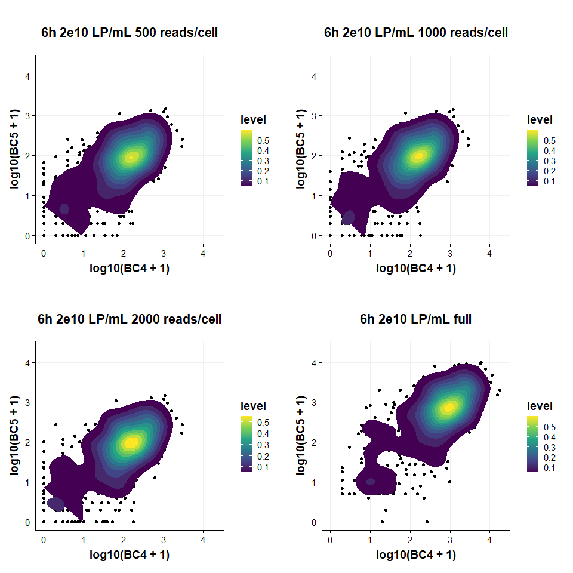
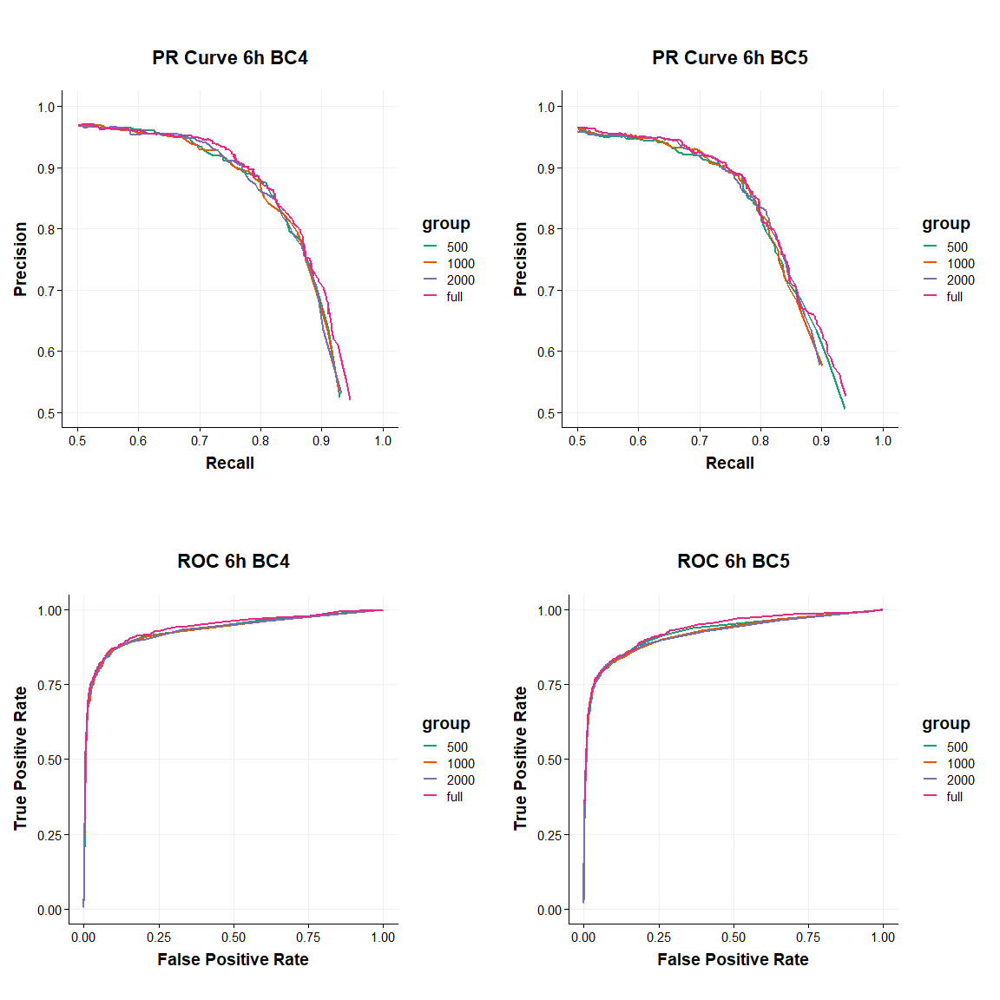

SIG03 oBC Direct Amp Barcode Analysis
================
Eric Y. Wang
2024-08-17

- [<u>Import Data</u>](#import-data)
- [<u>Downsample Data</u>](#downsample-data)
- [<u>Visualize Barcode
  Distributions</u>](#visualize-barcode-distributions)
- [<u>Barcode Classification</u>](#barcode-classification)

``` r
library(tidyverse)
```

    ## ── Attaching core tidyverse packages ──────────────────────── tidyverse 2.0.0 ──
    ## ✔ dplyr     1.1.4     ✔ readr     2.1.5
    ## ✔ forcats   1.0.0     ✔ stringr   1.5.1
    ## ✔ ggplot2   3.5.1     ✔ tibble    3.2.1
    ## ✔ lubridate 1.9.3     ✔ tidyr     1.3.1
    ## ✔ purrr     1.0.2     
    ## ── Conflicts ────────────────────────────────────────── tidyverse_conflicts() ──
    ## ✖ dplyr::filter() masks stats::filter()
    ## ✖ dplyr::lag()    masks stats::lag()
    ## ℹ Use the conflicted package (<http://conflicted.r-lib.org/>) to force all conflicts to become errors

``` r
library(Seurat)
```

    ## Loading required package: SeuratObject
    ## Loading required package: sp
    ## 
    ## Attaching package: 'SeuratObject'
    ## 
    ## The following objects are masked from 'package:base':
    ## 
    ##     intersect, t

``` r
library(ggplot2)
library(cowplot)
```

    ## 
    ## Attaching package: 'cowplot'
    ## 
    ## The following object is masked from 'package:lubridate':
    ## 
    ##     stamp

``` r
library(yardstick)
```

    ## Registered S3 method overwritten by 'yardstick':
    ##   method       from         
    ##   print.metric spatstat.geom
    ## 
    ## Attaching package: 'yardstick'
    ## 
    ## The following object is masked from 'package:readr':
    ## 
    ##     spec

``` r
library(DropletUtils)
```

    ## Loading required package: SingleCellExperiment
    ## Loading required package: SummarizedExperiment
    ## Loading required package: MatrixGenerics
    ## Loading required package: matrixStats
    ## 
    ## Attaching package: 'matrixStats'
    ## 
    ## The following object is masked from 'package:dplyr':
    ## 
    ##     count
    ## 
    ## 
    ## Attaching package: 'MatrixGenerics'
    ## 
    ## The following objects are masked from 'package:matrixStats':
    ## 
    ##     colAlls, colAnyNAs, colAnys, colAvgsPerRowSet, colCollapse,
    ##     colCounts, colCummaxs, colCummins, colCumprods, colCumsums,
    ##     colDiffs, colIQRDiffs, colIQRs, colLogSumExps, colMadDiffs,
    ##     colMads, colMaxs, colMeans2, colMedians, colMins, colOrderStats,
    ##     colProds, colQuantiles, colRanges, colRanks, colSdDiffs, colSds,
    ##     colSums2, colTabulates, colVarDiffs, colVars, colWeightedMads,
    ##     colWeightedMeans, colWeightedMedians, colWeightedSds,
    ##     colWeightedVars, rowAlls, rowAnyNAs, rowAnys, rowAvgsPerColSet,
    ##     rowCollapse, rowCounts, rowCummaxs, rowCummins, rowCumprods,
    ##     rowCumsums, rowDiffs, rowIQRDiffs, rowIQRs, rowLogSumExps,
    ##     rowMadDiffs, rowMads, rowMaxs, rowMeans2, rowMedians, rowMins,
    ##     rowOrderStats, rowProds, rowQuantiles, rowRanges, rowRanks,
    ##     rowSdDiffs, rowSds, rowSums2, rowTabulates, rowVarDiffs, rowVars,
    ##     rowWeightedMads, rowWeightedMeans, rowWeightedMedians,
    ##     rowWeightedSds, rowWeightedVars
    ## 
    ## Loading required package: GenomicRanges
    ## Loading required package: stats4
    ## Loading required package: BiocGenerics
    ## 
    ## Attaching package: 'BiocGenerics'
    ## 
    ## The following object is masked from 'package:SeuratObject':
    ## 
    ##     intersect
    ## 
    ## The following objects are masked from 'package:lubridate':
    ## 
    ##     intersect, setdiff, union
    ## 
    ## The following objects are masked from 'package:dplyr':
    ## 
    ##     combine, intersect, setdiff, union
    ## 
    ## The following objects are masked from 'package:stats':
    ## 
    ##     IQR, mad, sd, var, xtabs
    ## 
    ## The following objects are masked from 'package:base':
    ## 
    ##     anyDuplicated, aperm, append, as.data.frame, basename, cbind,
    ##     colnames, dirname, do.call, duplicated, eval, evalq, Filter, Find,
    ##     get, grep, grepl, intersect, is.unsorted, lapply, Map, mapply,
    ##     match, mget, order, paste, pmax, pmax.int, pmin, pmin.int,
    ##     Position, rank, rbind, Reduce, rownames, sapply, setdiff, table,
    ##     tapply, union, unique, unsplit, which.max, which.min
    ## 
    ## Loading required package: S4Vectors
    ## 
    ## Attaching package: 'S4Vectors'
    ## 
    ## The following objects are masked from 'package:lubridate':
    ## 
    ##     second, second<-
    ## 
    ## The following objects are masked from 'package:dplyr':
    ## 
    ##     first, rename
    ## 
    ## The following object is masked from 'package:tidyr':
    ## 
    ##     expand
    ## 
    ## The following object is masked from 'package:utils':
    ## 
    ##     findMatches
    ## 
    ## The following objects are masked from 'package:base':
    ## 
    ##     expand.grid, I, unname
    ## 
    ## Loading required package: IRanges
    ## 
    ## Attaching package: 'IRanges'
    ## 
    ## The following object is masked from 'package:sp':
    ## 
    ##     %over%
    ## 
    ## The following object is masked from 'package:lubridate':
    ## 
    ##     %within%
    ## 
    ## The following objects are masked from 'package:dplyr':
    ## 
    ##     collapse, desc, slice
    ## 
    ## The following object is masked from 'package:purrr':
    ## 
    ##     reduce
    ## 
    ## The following object is masked from 'package:grDevices':
    ## 
    ##     windows
    ## 
    ## Loading required package: GenomeInfoDb
    ## Loading required package: Biobase
    ## Welcome to Bioconductor
    ## 
    ##     Vignettes contain introductory material; view with
    ##     'browseVignettes()'. To cite Bioconductor, see
    ##     'citation("Biobase")', and for packages 'citation("pkgname")'.
    ## 
    ## 
    ## Attaching package: 'Biobase'
    ## 
    ## The following object is masked from 'package:MatrixGenerics':
    ## 
    ##     rowMedians
    ## 
    ## The following objects are masked from 'package:matrixStats':
    ## 
    ##     anyMissing, rowMedians
    ## 
    ## 
    ## Attaching package: 'SummarizedExperiment'
    ## 
    ## The following object is masked from 'package:Seurat':
    ## 
    ##     Assays
    ## 
    ## The following object is masked from 'package:SeuratObject':
    ## 
    ##     Assays

``` r
knitr::opts_chunk$set(echo = TRUE)
```

``` r
source("functions/plotting_fxns.R")
source("functions/scRNA_seq_analysis_functions.R")
theme_set(theme_Publication())
```

    ## 
    ## Attaching package: 'ggthemes'

    ## The following object is masked from 'package:cowplot':
    ## 
    ##     theme_map

### <u>Import Data</u>

``` r
# dataCD4 <- readRDS("/Users/wange7/Library/CloudStorage/GoogleDrive-ericwang314@gmail.com/My Drive/Lab/datasets/EYW/SIG03_10x_240706/seurat_outs/SIG03_mouse_oBC_DirectAmp_CD4.rds")

dataCD4 <- readRDS("C:/Users/Eric/My Drive/Lab/datasets/EYW/SIG03_10x_240706/seurat_outs/SIG03_mouse_oBC_DirectAmp_CD4.rds")
```

### <u>Downsample Data</u>

This library had 592,600,865 reads with a sequencing saturation of 72%.
Within the library, 75.3% of reads were usable resulting in a final
count of 8,857 reads per cell.

Targeting 500 reads per cell would correspond to 30 million reads or 5%
downsample

``` r
# downsample and add rownames
downBC500 <- downsampleReads("C:/Users/Eric/My Drive/Lab/datasets/EYW/SIG03_10x_240706/cellranger_outs/SIG03_GEX_HTO_oBC_DirectAmp_mouse/molecule_info.h5",
                           0.05, bycol = FALSE, use.library = "Custom")
downBC1000 <- downsampleReads("C:/Users/Eric/My Drive/Lab/datasets/EYW/SIG03_10x_240706/cellranger_outs/SIG03_GEX_HTO_oBC_DirectAmp_mouse/molecule_info.h5",
                           0.05, bycol = FALSE, use.library = "Custom")
downBC2000 <- downsampleReads("C:/Users/Eric/My Drive/Lab/datasets/EYW/SIG03_10x_240706/cellranger_outs/SIG03_GEX_HTO_oBC_DirectAmp_mouse/molecule_info.h5",
                           0.05, bycol = FALSE, use.library = "Custom")

# subset to only include cell bc present in processed data
downBC500 <- downBC500[,colnames(dataCD4)]
downBC1000 <- downBC1000[,colnames(dataCD4)]
downBC2000 <- downBC2000[,colnames(dataCD4)]
```

### <u>Visualize Barcode Distributions</u>

``` r
expressionData500 <- tibble(cell_bc = colnames(dataCD4),
                         hash.ID = dataCD4$hash.ID,
                         BC4 = downBC500["p139-BC5",],
                         BC5 = downBC500["p139-BC4",])
expressionData1000 <- tibble(cell_bc = colnames(dataCD4),
                         hash.ID = dataCD4$hash.ID,
                         BC4 = downBC1000["p139-BC5",],
                         BC5 = downBC1000["p139-BC4",])
expressionData2000 <- tibble(cell_bc = colnames(dataCD4),
                         hash.ID = dataCD4$hash.ID,
                         BC4 = downBC2000["p139-BC5",],
                         BC5 = downBC2000["p139-BC4",])
expressionData <- tibble(cell_bc = colnames(dataCD4),
                         hash.ID = dataCD4$hash.ID,
                         BC4 = dataCD4@assays$BC$counts["p139-BC5",],
                         BC5 = dataCD4@assays$BC$counts["p139-BC4",])

p1 <- expressionData500 %>%
  filter(hash.ID %in% c("CD4-6h-2e10")) %>%
  ggplot(aes(x = log10(BC4 + 1), y = log10(BC5 + 1))) +
    geom_point() +
    stat_density2d(aes(fill = after_stat(level)), geom = "polygon") +
    scale_fill_viridis_c() +
    theme(aspect.ratio = 1) +
    xlim(0,4.3)+
    ylim(0,4.3) +
    ggtitle("6h 2e10 LP/mL 500 reads/cell")

p2 <- expressionData1000 %>%
  filter(hash.ID %in% c("CD4-6h-2e10")) %>%
  ggplot(aes(x = log10(BC4 + 1), y = log10(BC5 + 1))) +
    geom_point() +
    stat_density2d(aes(fill = after_stat(level)), geom = "polygon") +
    scale_fill_viridis_c() +
    theme(aspect.ratio = 1) +
    xlim(0,4.3)+
    ylim(0,4.3) +
    ggtitle("6h 2e10 LP/mL 1000 reads/cell")

p3 <- expressionData2000 %>%
  filter(hash.ID %in% c("CD4-6h-2e10")) %>%
  ggplot(aes(x = log10(BC4 + 1), y = log10(BC5 + 1))) +
    geom_point() +
    stat_density2d(aes(fill = after_stat(level)), geom = "polygon") +
    scale_fill_viridis_c() +
    theme(aspect.ratio = 1) +
    xlim(0,4.3)+
    ylim(0,4.3) +
    ggtitle("6h 2e10 LP/mL 2000 reads/cell")

p4 <- expressionData %>%
  filter(hash.ID %in% c("CD4-6h-2e10")) %>%
  ggplot(aes(x = log10(BC4 + 1), y = log10(BC5 + 1))) +
    geom_point() +
    stat_density2d(aes(fill = after_stat(level)), geom = "polygon") +
    scale_fill_viridis_c() +
    theme(aspect.ratio = 1) +
    xlim(0,4.3)+
    ylim(0,4.3) +
    ggtitle("6h 2e10 LP/mL full")

plot_grid(p1,p2,p3,p4, ncol = 2)
```

<!-- -->

### <u>Barcode Classification</u>

``` r
data6hCD4 <- subset(dataCD4, subset = hash.ID %in% c("CD4-6h-2e10","CD4-6h-0"))

downBC5006h <- downBC500[,colnames(data6hCD4)]
downBC10006h <- downBC1000[,colnames(data6hCD4)]
downBC20006h <- downBC2000[,colnames(data6hCD4)]
```

#### Barcode 4 Recall

Create test datasets for 6h

``` r
testDataList <- vector(mode = "list")

testDataList[["500"]] <- tibble(hash.ID = data6hCD4$hash.ID,
                   umi_counts = downBC5006h["p139-BC4",]) %>%
  filter(hash.ID %in% c("CD4-6h-2e10","CD4-6h-0")) %>%
  mutate(label = case_when(hash.ID == "CD4-6h-0" ~ "negative",
                           hash.ID == "CD4-6h-2e10" ~ "positive")) %>%
  mutate(label = factor(label, c("positive","negative")))

testDataList[["1000"]] <- tibble(hash.ID = data6hCD4$hash.ID,
                   umi_counts = downBC10006h["p139-BC4",]) %>%
  filter(hash.ID %in% c("CD4-6h-2e10","CD4-6h-0")) %>%
  mutate(label = case_when(hash.ID == "CD4-6h-0" ~ "negative",
                           hash.ID == "CD4-6h-2e10" ~ "positive")) %>%
  mutate(label = factor(label, c("positive","negative")))

testDataList[["2000"]] <- tibble(hash.ID = data6hCD4$hash.ID,
                   umi_counts = downBC20006h["p139-BC4",]) %>%
  filter(hash.ID %in% c("CD4-6h-2e10","CD4-6h-0")) %>%
  mutate(label = case_when(hash.ID == "CD4-6h-0" ~ "negative",
                           hash.ID == "CD4-6h-2e10" ~ "positive")) %>%
  mutate(label = factor(label, c("positive","negative")))

testDataList[["full"]] <- tibble(hash.ID = data6hCD4$hash.ID,
                   umi_counts = data6hCD4@assays$BC$counts["p139-BC4",]) %>%
  filter(hash.ID %in% c("CD4-6h-2e10","CD4-6h-0")) %>%
  mutate(label = case_when(hash.ID == "CD4-6h-0" ~ "negative",
                           hash.ID == "CD4-6h-2e10" ~ "positive")) %>%
  mutate(label = factor(label, c("positive","negative")))
```

``` r
# Function to classify cells based on UMI count cutoff
classify_cells <- function(data, umi_cutoff) {
  data %>%
    mutate(predicted_label = ifelse(umi_counts >= umi_cutoff, "positive", "negative")) %>%
    mutate(predicted_label = factor(predicted_label, c("positive","negative")))
}

# range of UMI cutoffs to test
umi_cutoffs <- seq(0,1000, by = 1)

results <- tibble()
for(i in 1:length(testDataList)){
  temp <- map_df(umi_cutoffs, function(cutoff) {
  classified_data <- classify_cells(testDataList[[i]], cutoff)
  
  metrics <- classified_data %>%
    precision(truth = label, estimate = predicted_label) %>%
    bind_rows(
      classified_data %>%
        recall(truth = label, estimate = predicted_label),
      classified_data %>%
        sensitivity(truth = label, estimate = predicted_label),
      classified_data %>%
        specificity(truth = label, estimate = predicted_label),
    )
  metrics %>%
    mutate(umi_cutoff = cutoff)
  })
  # add category label to results
  temp <- mutate(temp, group = names(testDataList)[i])
  results <- bind_rows(results,temp)
}
write_csv(results, "analysis_outs/umi_cutoff_oBCDirect_metrics_BC4_6h_2e10_downsample_cell.csv")

# plot PR curve
pr1 <- results %>%
  filter(.metric %in% c("precision", "recall")) %>%
  pivot_wider(names_from = .metric, values_from = .estimate) %>%
  mutate(group = factor(group, c("500","1000","2000","full"))) %>%
  ggplot(aes(x = recall, y = precision, color = group)) +
    geom_line(linewidth=1) +
    scale_color_brewer(palette = "Dark2") +
    labs(title = "PR Curve 6h BC4", x = "Recall", y = "Precision") +
    theme(aspect.ratio = 1) +
    xlim(0.5,1) +
    ylim(0.5,1)

# plot ROC
roc1 <- results %>%
  filter(.metric %in% c("sensitivity", "specificity")) %>%
  pivot_wider(names_from = .metric, values_from = .estimate) %>%
  mutate(FPR = 1-specificity) %>%
  mutate(group = factor(group, c("500","1000","2000","full"))) %>%
  ggplot(aes(x = FPR, y = sensitivity, color = group)) +
    geom_line(linewidth=1) +
    scale_color_brewer(palette = "Dark2") +
    labs(title = "ROC 6h BC4", x = "False Positive Rate", y = "True Positive Rate") +
    theme(aspect.ratio = 1) +
    xlim(0,1) +
    ylim(0,1)
```

#### Barcode 5 Recall

Create test datasets for 6h

``` r
testDataList <- vector(mode = "list")

testDataList[["500"]] <- tibble(hash.ID = data6hCD4$hash.ID,
                   umi_counts = downBC5006h["p139-BC5",]) %>%
  filter(hash.ID %in% c("CD4-6h-2e10","CD4-6h-0")) %>%
  mutate(label = case_when(hash.ID == "CD4-6h-0" ~ "negative",
                           hash.ID == "CD4-6h-2e10" ~ "positive")) %>%
  mutate(label = factor(label, c("positive","negative")))

testDataList[["1000"]] <- tibble(hash.ID = data6hCD4$hash.ID,
                   umi_counts = downBC10006h["p139-BC5",]) %>%
  filter(hash.ID %in% c("CD4-6h-2e10","CD4-6h-0")) %>%
  mutate(label = case_when(hash.ID == "CD4-6h-0" ~ "negative",
                           hash.ID == "CD4-6h-2e10" ~ "positive")) %>%
  mutate(label = factor(label, c("positive","negative")))

testDataList[["2000"]] <- tibble(hash.ID = data6hCD4$hash.ID,
                   umi_counts = downBC20006h["p139-BC5",]) %>%
  filter(hash.ID %in% c("CD4-6h-2e10","CD4-6h-0")) %>%
  mutate(label = case_when(hash.ID == "CD4-6h-0" ~ "negative",
                           hash.ID == "CD4-6h-2e10" ~ "positive")) %>%
  mutate(label = factor(label, c("positive","negative")))

testDataList[["full"]] <- tibble(hash.ID = data6hCD4$hash.ID,
                   umi_counts = data6hCD4@assays$BC$counts["p139-BC5",]) %>%
  filter(hash.ID %in% c("CD4-6h-2e10","CD4-6h-0")) %>%
  mutate(label = case_when(hash.ID == "CD4-6h-0" ~ "negative",
                           hash.ID == "CD4-6h-2e10" ~ "positive")) %>%
  mutate(label = factor(label, c("positive","negative")))
```

``` r
# Function to classify cells based on UMI count cutoff
classify_cells <- function(data, umi_cutoff) {
  data %>%
    mutate(predicted_label = ifelse(umi_counts >= umi_cutoff, "positive", "negative")) %>%
    mutate(predicted_label = factor(predicted_label, c("positive","negative")))
}

# range of UMI cutoffs to test
umi_cutoffs <- seq(0,1000, by = 1)

results <- tibble()
for(i in 1:length(testDataList)){
  temp <- map_df(umi_cutoffs, function(cutoff) {
  classified_data <- classify_cells(testDataList[[i]], cutoff)
  
  metrics <- classified_data %>%
    precision(truth = label, estimate = predicted_label) %>%
    bind_rows(
      classified_data %>%
        recall(truth = label, estimate = predicted_label),
      classified_data %>%
        sensitivity(truth = label, estimate = predicted_label),
      classified_data %>%
        specificity(truth = label, estimate = predicted_label),
    )
  metrics %>%
    mutate(umi_cutoff = cutoff)
  })
  # add category label to results
  temp <- mutate(temp, group = names(testDataList)[i])
  results <- bind_rows(results,temp)
}
write_csv(results, "analysis_outs/umi_cutoff_oBCDirect_metrics_BC5_6h_2e10_downsample_cell.csv")

# plot PR curve
pr3 <- results %>%
  filter(.metric %in% c("precision", "recall")) %>%
  pivot_wider(names_from = .metric, values_from = .estimate) %>%
  mutate(group = factor(group, c("500","1000","2000","full"))) %>%
  ggplot(aes(x = recall, y = precision, color = group)) +
    geom_line(linewidth=1) +
    scale_color_brewer(palette = "Dark2") +
    labs(title = "PR Curve 6h BC5", x = "Recall", y = "Precision") +
    theme(aspect.ratio = 1) +
    xlim(0.5,1) +
    ylim(0.5,1)

# plot ROC
roc3 <- results %>%
  filter(.metric %in% c("sensitivity", "specificity")) %>%
  pivot_wider(names_from = .metric, values_from = .estimate) %>%
  mutate(FPR = 1-specificity) %>%
  mutate(group = factor(group, c("500","1000","2000","full"))) %>%
  ggplot(aes(x = FPR, y = sensitivity, color = group)) +
    geom_line(linewidth=1) +
    scale_color_brewer(palette = "Dark2") +
    labs(title = "ROC 6h BC5", x = "False Positive Rate", y = "True Positive Rate") +
    theme(aspect.ratio = 1) +
    xlim(0,1) +
    ylim(0,1)
```

#### Visualize

``` r
plot_grid(pr1,pr3,roc1,roc3)
```

    ## Warning: Removed 3220 rows containing missing values or values outside the scale range
    ## (`geom_line()`).

    ## Warning: Removed 3105 rows containing missing values or values outside the scale range
    ## (`geom_line()`).

<!-- -->
