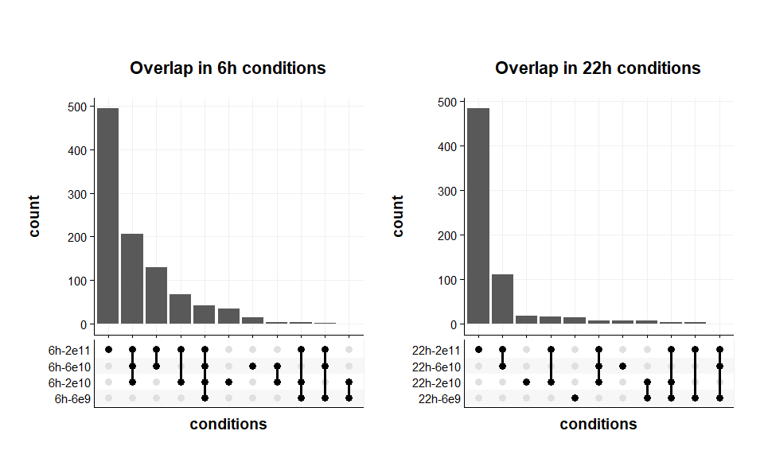
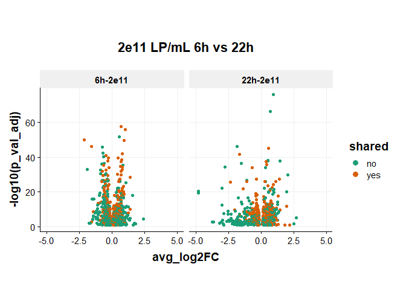
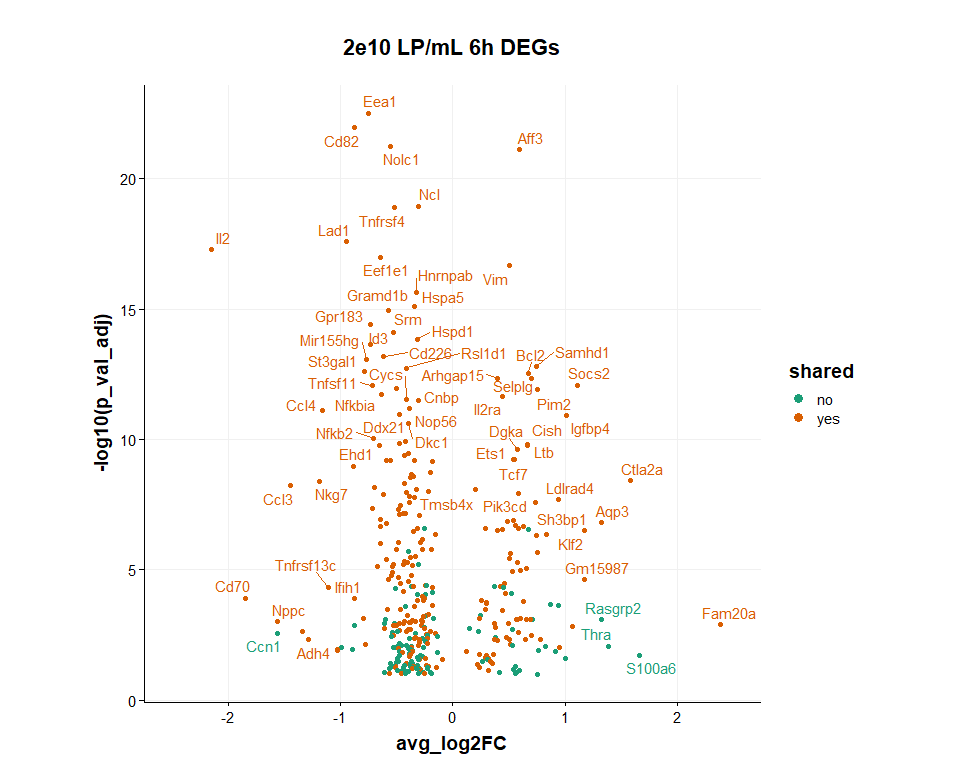
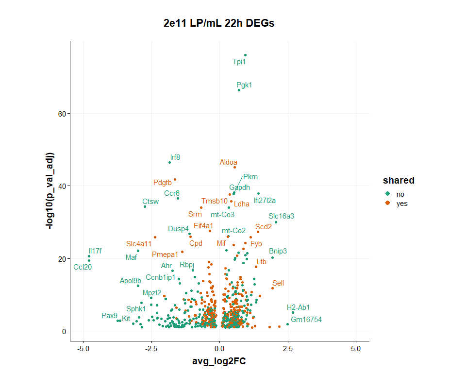

SIG03 Viral-induced DEG analysis
================
Eric Y. Wang
2024-08-05

- [<u>Import Data</u>](#import-data)
- [<u>Seurat DEG calculations</u>](#seurat-deg-calculations)
- [<u>DEG comparison plots</u>](#deg-comparison-plots)
- [<u>DEG signature analysis</u>](#deg-signature-analysis)

``` r
source("functions/plotting_fxns.R")
source("functions/scRNA_seq_analysis_functions.R")
theme_set(theme_Publication())
```

    ## 
    ## Attaching package: 'ggthemes'

    ## The following object is masked from 'package:cowplot':
    ## 
    ##     theme_map

### <u>Import Data</u>

``` r
# dataCD4 <- readRDS("/Users/wange7/Library/CloudStorage/GoogleDrive-ericwang314@gmail.com/My Drive/Lab/datasets/EYW/SIG03_10x_240706/seurat_outs/SIG03_mouse_oBC_DirectAmp_CD4.rds")

dataCD4 <- readRDS("C:/Users/Eric/My Drive/Lab/datasets/EYW/SIG03_10x_240706/seurat_outs/SIG03_mouse_oBC_DirectAmp_CD4.rds")
```

### <u>Seurat DEG calculations</u>

``` r
Idents(dataCD4) <- "hash.ID"
DefaultAssay(dataCD4) <- "SCT"

# create list of DEGs for 6h timepoint
degList <- vector(mode = "list")
degList[["6h-2e11"]] <- FindMarkers(dataCD4, ident.1 = "CD4-6h-2e11", ident.2 = "CD4-6h-0",
                                    min.pct = -Inf, logfc.threshold = -Inf,
                                    min.cells.feature = 1,min.cells.group = 1) %>%
  as_tibble(rownames = "genes")
degList[["6h-6e10"]] <- FindMarkers(dataCD4, ident.1 = "CD4-6h-6e10", ident.2 = "CD4-6h-0",
                                    min.pct = -Inf, logfc.threshold = -Inf,
                                    min.cells.feature = 1,min.cells.group = 1) %>%
  as_tibble(rownames = "genes")
degList[["6h-2e10"]] <- FindMarkers(dataCD4, ident.1 = "CD4-6h-2e10", ident.2 = "CD4-6h-0",
                                    min.pct = -Inf, logfc.threshold = -Inf,
                                    min.cells.feature = 1,min.cells.group = 1) %>%
  as_tibble(rownames = "genes")
degList[["6h-6e9"]] <- FindMarkers(dataCD4, ident.1 = "CD4-6h-6e9", ident.2 = "CD4-6h-0",
                                    min.pct = -Inf, logfc.threshold = -Inf,
                                    min.cells.feature = 1,min.cells.group = 1) %>%
  as_tibble(rownames = "genes")
degList[["22h-2e11"]] <- FindMarkers(dataCD4, ident.1 = "CD4-22h-2e11", ident.2 = "CD4-22h-0",
                                    min.pct = -Inf, logfc.threshold = -Inf,
                                    min.cells.feature = 1,min.cells.group = 1) %>%
  as_tibble(rownames = "genes")
degList[["22h-6e10"]] <- FindMarkers(dataCD4, ident.1 = "CD4-22h-6e10", ident.2 = "CD4-22h-0",
                                    min.pct = -Inf, logfc.threshold = -Inf,
                                    min.cells.feature = 1,min.cells.group = 1) %>%
  as_tibble(rownames = "genes")
degList[["22h-2e10"]] <- FindMarkers(dataCD4, ident.1 = "CD4-22h-2e10", ident.2 = "CD4-22h-0",
                                    min.pct = -Inf, logfc.threshold = -Inf,
                                    min.cells.feature = 1,min.cells.group = 1) %>%
  as_tibble(rownames = "genes")
degList[["22h-6e9"]] <- FindMarkers(dataCD4, ident.1 = "CD4-22h-6e9", ident.2 = "CD4-22h-0",
                                    min.pct = -Inf, logfc.threshold = -Inf,
                                    min.cells.feature = 1,min.cells.group = 1) %>%
  as_tibble(rownames = "genes")

degTib <- map_dfr(degList, bind_rows, .id = "conditions")
degTib <- mutate(degTib, conditions = factor(conditions, c("6h-2e11","6h-6e10","6h-2e10","6h-6e9","6h-0","22h-2e11","22h-6e10","22h-2e10","22h-6e9","22h-0")))

# remove p139 gene
degTib <- filter(degTib, genes != "p139-T7oBC5p-MS2")

# create separate tibble with significant genes
degTibSig <- filter(degTib, p_val_adj < 0.1)
```

``` r
Idents(dataCD4) <- "hash.ID"
DefaultAssay(dataCD4) <- "SCT"

# create list of DEGs for 6h timepoint
degListViralTiter <- vector(mode = "list")
degListViralTiter[["6h-2e11_6e10"]] <- FindMarkers(dataCD4, ident.1 = "CD4-6h-2e11", ident.2 = "CD4-6h-6e10",
                                    min.pct = -Inf, logfc.threshold = -Inf,
                                    min.cells.feature = 1,min.cells.group = 1) %>%
  as_tibble(rownames = "genes")
degListViralTiter[["6h-2e11_2e10"]] <- FindMarkers(dataCD4, ident.1 = "CD4-6h-2e11", ident.2 = "CD4-6h-2e10",
                                    min.pct = -Inf, logfc.threshold = -Inf,
                                    min.cells.feature = 1,min.cells.group = 1) %>%
  as_tibble(rownames = "genes")
degListViralTiter[["6h-2e11_6e9"]] <- FindMarkers(dataCD4, ident.1 = "CD4-6h-2e11", ident.2 = "CD4-6h-6e9",
                                    min.pct = -Inf, logfc.threshold = -Inf,
                                    min.cells.feature = 1,min.cells.group = 1) %>%
  as_tibble(rownames = "genes")

degTibViralTiter <- map_dfr(degListViralTiter, bind_rows, .id = "conditions")
degTibViralTiter <- mutate(degTibViralTiter, conditions = factor(conditions, c("6h-2e11_6e10","6h-2e11_2e10","6h-2e11_6e9")))

# remove p139 gene
degTibViralTiter <- filter(degTibViralTiter, genes != "p139-T7oBC5p-MS2")

# create separate tibble with significant genes
degTibViralTiterSig <- filter(degTibViralTiter, p_val_adj < 0.1)
```

### <u>DEG comparison plots</u>

#### DEG quantification

Plot DEGs compared to the no virus condition

``` r
p1 <- ggplot(degTibSig, aes(x = conditions, fill = conditions)) +
  geom_bar(stat = "count", color = "black") +
  scale_fill_manual(values = rev(c(brewer.pal(n=4, name = "OrRd"),brewer.pal(n=4,name = "Blues")))) +
  theme(axis.text.x = element_text(angle = 90, vjust = 0.5, hjust = 1)) +
  scale_y_continuous(expand = c(0,0)) +
  ggtitle("number of DEGs")

p2 <- degTibSig %>%
  mutate(absolute_log2FC = abs(avg_log2FC)) %>%
  ggplot(aes(x = conditions, y = absolute_log2FC, fill = conditions)) +
    scale_fill_manual(values = rev(c(brewer.pal(n=4, name = "OrRd"),brewer.pal(n=4,name = "Blues")))) +
    geom_boxplot() +
    theme(axis.text.x = element_text(angle = 90, vjust = 0.5, hjust = 1)) +
    ggtitle("absolute log2FC distribution")

p1+p2
```

<!-- -->

I’m worried that the 6e10 - 6e9 conditions may be biased because of
fewer numbers of cells in those conditions. See below:

``` r
dataCD4@meta.data %>%
  group_by(hash.ID) %>%
  mutate(hash.ID = factor(hash.ID, c("CD4-6h-2e11","CD4-6h-6e10","CD4-6h-2e10","CD4-6h-6e9","CD4-6h-0","CD4-22h-2e11","CD4-22h-6e10","CD4-22h-2e10","CD4-22h-6e9","CD4-22h-0","Treg-4h"))) %>%
  summarize(num_cells = n()) %>%
  mutate(percent = num_cells/sum(num_cells)*100)
```

    ## # A tibble: 11 × 3
    ##    hash.ID      num_cells percent
    ##    <fct>            <int>   <dbl>
    ##  1 CD4-6h-2e11       2411   14.7 
    ##  2 CD4-6h-6e10       1521    9.25
    ##  3 CD4-6h-2e10        755    4.59
    ##  4 CD4-6h-6e9         873    5.31
    ##  5 CD4-6h-0          1905   11.6 
    ##  6 CD4-22h-2e11      4832   29.4 
    ##  7 CD4-22h-6e10      1928   11.7 
    ##  8 CD4-22h-2e10       320    1.95
    ##  9 CD4-22h-6e9        213    1.30
    ## 10 CD4-22h-0          535    3.25
    ## 11 Treg-4h           1154    7.02

Plot DEGs between different viral titers at 6h

``` r
ggplot(degTibViralTiterSig, aes(x = conditions, fill = conditions)) +
  geom_bar(stat = "count", color = "black") +
  scale_fill_manual(values = rev(c(brewer.pal(n=4, name = "OrRd"),brewer.pal(n=4,name = "Blues")))) +
  theme(axis.text.x = element_text(angle = 90, vjust = 0.5, hjust = 1)) +
  scale_y_continuous(expand = c(0,0)) +
  ggtitle("number of DEGs")
```

<!-- -->

#### overlap comparisons

Here I will compare the overlap in DEGs (identified by comparing virus
condition to 0 virus condition in each timepoint independently).

``` r
p1 <- degTibSig %>%
  filter(conditions %in% c("6h-2e11","6h-6e10","6h-2e10","6h-6e9","6h-0")) %>%
  mutate(conditions = as.character(conditions)) %>%
  group_by(genes) %>%
  summarise(conditions = list(unique(conditions))) %>%
  ggplot(aes(x=conditions)) +
    geom_bar() +
    scale_x_upset(n_intersections = 40) +
    ggtitle("Overlap in 6h conditions")

p2 <- degTibSig %>%
  filter(conditions %in% c("22h-2e11","22h-6e10","22h-2e10","22h-6e9","22h-0")) %>%
  mutate(conditions = as.character(conditions)) %>%
  group_by(genes) %>%
  summarise(conditions = list(unique(conditions))) %>%
  ggplot(aes(x=conditions)) +
    geom_bar() +
    scale_x_upset(n_intersections = 40) +
    ggtitle("Overlap in 22h conditions")

p3 <- degTibSig %>%
  filter(conditions %in% c("6h-2e11","22h-2e11")) %>%
  mutate(conditions = as.character(conditions)) %>%
  group_by(genes) %>%
  summarise(conditions = list(unique(conditions))) %>%
  ggplot(aes(x=conditions)) +
    geom_bar() +
    scale_x_upset(n_intersections = 40)

p4 <- degTibSig %>%
  filter(conditions %in% c("6h-6e10","22h-6e10")) %>%
  mutate(conditions = as.character(conditions)) %>%
  group_by(genes) %>%
  summarise(conditions = list(unique(conditions))) %>%
  ggplot(aes(x=conditions)) +
    geom_bar() +
    scale_x_upset(n_intersections = 40)

p5 <- degTibSig %>%
  filter(conditions %in% c("6h-2e10","22h-2e10")) %>%
  mutate(conditions = as.character(conditions)) %>%
  group_by(genes) %>%
  summarise(conditions = list(unique(conditions))) %>%
  ggplot(aes(x=conditions)) +
    geom_bar() +
    scale_x_upset(n_intersections = 40)

p6 <- degTibSig %>%
  filter(conditions %in% c("6h-6e9","22h-6e9")) %>%
  mutate(conditions = as.character(conditions)) %>%
  group_by(genes) %>%
  summarise(conditions = list(unique(conditions))) %>%
  ggplot(aes(x=conditions)) +
    geom_bar() +
    scale_x_upset(n_intersections = 40)

p1+p2
```

<!-- -->

``` r
plot_grid(p3,p4,p5,p6, ncol = 4)
```

<!-- -->

``` r
# identify significant genes from any condition
sigGenes <- filter(degTibSig, conditions %in% c("6h-2e11","6h-6e10","6h-2e10","6h-6e9"))$genes %>% unique()

p1 <- degTib %>%
  filter(conditions %in% c("6h-2e11","6h-6e10")) %>%
  filter(genes %in% sigGenes) %>%
  select(genes, conditions, avg_log2FC) %>%
  pivot_wider(names_from = conditions, values_from = avg_log2FC) %>%
  ggplot(aes(x = `6h-2e11`, y = `6h-6e10`)) +
    geom_point() +
    xlim(-3,3) +
    ylim(-3,3) +
    theme(aspect.ratio = 1)

p2 <- degTib %>%
  filter(conditions %in% c("6h-2e11","6h-2e10")) %>%
  filter(genes %in% sigGenes) %>%
  select(genes, conditions, avg_log2FC) %>%
  pivot_wider(names_from = conditions, values_from = avg_log2FC) %>%
  ggplot(aes(x = `6h-2e11`, y = `6h-2e10`)) +
    geom_point() +
    xlim(-3,3) +
    ylim(-3,3) +
    theme(aspect.ratio = 1)

p3 <- degTib %>%
  filter(conditions %in% c("6h-2e11","6h-6e9")) %>%
  filter(genes %in% sigGenes) %>%
  select(genes, conditions, avg_log2FC) %>%
  pivot_wider(names_from = conditions, values_from = avg_log2FC) %>%
  ggplot(aes(x = `6h-2e11`, y = `6h-6e9`)) +
    geom_point() +
    xlim(-3,3) +
    ylim(-3,3) +
    theme(aspect.ratio = 1)

p1+p2+p3
```

<!-- -->

``` r
sigGenes <- filter(degTibSig, conditions %in% c("22h-2e11","22h-6e10","22h-2e10","22h-6e9"))$genes %>% unique()

p1 <- degTib %>%
  filter(conditions %in% c("22h-2e11","22h-6e10")) %>%
  filter(genes %in% sigGenes) %>%
  select(genes, conditions, avg_log2FC) %>%
  pivot_wider(names_from = conditions, values_from = avg_log2FC) %>%
  ggplot(aes(x = `22h-2e11`, y = `22h-6e10`)) +
    geom_point() +
    xlim(-3,3) +
    ylim(-3,3) +
    theme(aspect.ratio = 1)

p2 <- degTib %>%
  filter(conditions %in% c("22h-2e11","22h-2e10")) %>%
  filter(genes %in% sigGenes) %>%
  select(genes, conditions, avg_log2FC) %>%
  pivot_wider(names_from = conditions, values_from = avg_log2FC) %>%
  ggplot(aes(x = `22h-2e11`, y = `22h-2e10`)) +
    geom_point() +
    xlim(-3,3) +
    ylim(-3,3) +
    theme(aspect.ratio = 1)

p3 <- degTib %>%
  filter(conditions %in% c("22h-2e11","22h-6e9")) %>%
  filter(genes %in% sigGenes) %>%
  select(genes, conditions, avg_log2FC) %>%
  pivot_wider(names_from = conditions, values_from = avg_log2FC) %>%
  ggplot(aes(x = `22h-2e11`, y = `22h-6e9`)) +
    geom_point() +
    xlim(-3,3) +
    ylim(-3,3) +
    theme(aspect.ratio = 1)

p1+p2+p3
```

    ## Warning: Removed 7 rows containing missing values or values outside the scale range
    ## (`geom_point()`).
    ## Removed 7 rows containing missing values or values outside the scale range
    ## (`geom_point()`).

    ## Warning: Removed 8 rows containing missing values or values outside the scale range
    ## (`geom_point()`).

<!-- -->

``` r
sigGenes <- filter(degTibSig, conditions %in% c("22h-2e11","6h-2e11"))$genes %>% unique()
p1 <- degTib %>%
  filter(conditions %in% c("22h-2e11","6h-2e11")) %>%
  filter(genes %in% sigGenes) %>%
  select(genes, conditions, avg_log2FC) %>%
  pivot_wider(names_from = conditions, values_from = avg_log2FC) %>%
  ggplot(aes(x = `22h-2e11`, y = `6h-2e11`)) +
    geom_point() +
    xlim(-5,5) +
    ylim(-5,5) +
    theme(aspect.ratio = 1)

sigGenes <- filter(degTibSig, conditions %in% c("22h-6e10","6h-6e10"))$genes %>% unique()
p2 <- degTib %>%
  filter(conditions %in% c("22h-6e10","6h-6e10")) %>%
  filter(genes %in% sigGenes) %>%
  select(genes, conditions, avg_log2FC) %>%
  pivot_wider(names_from = conditions, values_from = avg_log2FC) %>%
  ggplot(aes(x = `22h-6e10`, y = `6h-6e10`)) +
    geom_point() +
    xlim(-5,5) +
    ylim(-5,5) +
    theme(aspect.ratio = 1)

p1+p2
```

<!-- -->

### <u>DEG signature analysis</u>

``` r
library(ggrepel)
```

#### Volcano Plots

``` r
# identify genes that are shared by 3 or 4 conditions at 6h
sharedGenes <- degTibSig %>%
  filter(conditions %in% c("6h-2e11","22h-2e11")) %>%
  mutate(conditions = as.character(conditions)) %>%
  group_by(genes) %>%
  summarise(conditions = length(unique(conditions))) %>%
  filter(conditions == 2)
sharedGenes <- sharedGenes$genes

degTibSig %>%
  filter(conditions %in% c("22h-2e11","6h-2e11")) %>%
  mutate(shared = ifelse(genes %in% sharedGenes,"yes","no")) %>%
  ggplot(aes(x = avg_log2FC, y = -log10(p_val_adj), color = shared)) +
    geom_point() +
    scale_color_brewer(palette = "Dark2") +
    facet_wrap(~conditions) +
    xlim(-5,5) +
    ggtitle("2e11 LP/mL 6h vs 22h") +
    guides(colour = guide_legend(override.aes = list(size=3))) +
    theme(aspect.ratio = 1)
```

<!-- -->

``` r
# identify genes that are shared by 3 or 4 conditions at 6h
sharedGenes <- degTibSig %>%
  filter(conditions %in% c("6h-2e11","6h-6e10","6h-2e10","6h-6e9")) %>%
  mutate(conditions = as.character(conditions)) %>%
  group_by(genes) %>%
  summarise(conditions = length(unique(conditions))) %>%
  filter(conditions %in% c(3,4))
sharedGenes <- sharedGenes$genes

degTibSig %>%
  filter(conditions %in% c("6h-2e11")) %>%
  mutate(shared = ifelse(genes %in% sharedGenes,"yes","no")) %>%
  ggplot(aes(x = avg_log2FC, y = -log10(p_val_adj), color = shared)) +
    geom_point() +
    geom_text_repel(aes(label = genes),show.legend = FALSE) +
    scale_color_brewer(palette = "Dark2") +
    xlim(-2.5,2.5) +
    ggtitle("2e11 LP/mL 6h DEGs") +
    guides(colour = guide_legend(override.aes = list(size=3))) +
    theme(aspect.ratio = 1)
```

    ## Warning: ggrepel: 879 unlabeled data points (too many overlaps). Consider
    ## increasing max.overlaps

<!-- -->

``` r
degTibSig %>%
  filter(conditions %in% c("6h-2e10")) %>%
  mutate(shared = ifelse(genes %in% sharedGenes,"yes","no")) %>%
  ggplot(aes(x = avg_log2FC, y = -log10(p_val_adj), color = shared)) +
    geom_point() +
    geom_text_repel(aes(label = genes),show.legend = FALSE) +
    scale_color_brewer(palette = "Dark2") +
    xlim(-2.5,2.5) +
    ggtitle("2e10 LP/mL 6h DEGs") +
    guides(colour = guide_legend(override.aes = list(size=3))) +
    theme(aspect.ratio = 1)
```

    ## Warning: ggrepel: 294 unlabeled data points (too many overlaps). Consider
    ## increasing max.overlaps

<!-- -->

``` r
# identify genes that are shared by 3 or 4 conditions at 6h
sharedGenes <- degTibSig %>%
  filter(conditions %in% c("6h-2e11","22h-2e11")) %>%
  mutate(conditions = as.character(conditions)) %>%
  group_by(genes) %>%
  summarise(conditions = length(unique(conditions))) %>%
  filter(conditions == 2)
sharedGenes <- sharedGenes$genes

# plot DEGs shared with 6h-2e11 condition
degTibSig %>%
  filter(conditions %in% c("22h-2e11")) %>%
  mutate(shared = ifelse(genes %in% sharedGenes,"yes","no")) %>%
  ggplot(aes(x = avg_log2FC, y = -log10(p_val_adj), color = shared)) +
    geom_point() +
    geom_text_repel(aes(label = genes),show.legend = FALSE) +
    scale_color_brewer(palette = "Dark2") +
    xlim(-5,5) +
    ggtitle("2e11 LP/mL 22h DEGs") +
    guides(colour = guide_legend(override.aes = list(size=3))) +
    theme(aspect.ratio = 1)
```

    ## Warning: ggrepel: 586 unlabeled data points (too many overlaps). Consider
    ## increasing max.overlaps

<!-- -->

``` r
degTibSig %>%
  filter(conditions %in% c("22h-2e11")) %>%
  filter(genes %in% sharedGenes) %>%
  ggplot(aes(x = avg_log2FC, y = -log10(p_val_adj))) +
    geom_point() +
    geom_text_repel(aes(label = genes),show.legend = FALSE) +
    scale_color_brewer(palette = "Dark2") +
    xlim(-2.5,2.5) +
    ggtitle("2e11 LP/mL 22h DEGs Shared with 6h") +
    guides(colour = guide_legend(override.aes = list(size=3))) +
    theme(aspect.ratio = 1)
```

    ## Warning: ggrepel: 224 unlabeled data points (too many overlaps). Consider
    ## increasing max.overlaps

<!-- -->

#### GSEA analysis

``` r
library(clusterProfiler)
```

    ## 

    ## clusterProfiler v4.12.2 Learn more at https://yulab-smu.top/contribution-knowledge-mining/
    ## 
    ## Please cite:
    ## 
    ## T Wu, E Hu, S Xu, M Chen, P Guo, Z Dai, T Feng, L Zhou, W Tang, L Zhan,
    ## X Fu, S Liu, X Bo, and G Yu. clusterProfiler 4.0: A universal
    ## enrichment tool for interpreting omics data. The Innovation. 2021,
    ## 2(3):100141

    ## 
    ## Attaching package: 'clusterProfiler'

    ## The following object is masked from 'package:purrr':
    ## 
    ##     simplify

    ## The following object is masked from 'package:stats':
    ## 
    ##     filter

``` r
library(babelgene)
library(msigdbr)
library(fgsea)
library(org.Hs.eg.db)
```

    ## Loading required package: AnnotationDbi

    ## Loading required package: stats4

    ## Loading required package: BiocGenerics

    ## 
    ## Attaching package: 'BiocGenerics'

    ## The following object is masked from 'package:babelgene':
    ## 
    ##     species

    ## The following object is masked from 'package:SeuratObject':
    ## 
    ##     intersect

    ## The following objects are masked from 'package:lubridate':
    ## 
    ##     intersect, setdiff, union

    ## The following objects are masked from 'package:dplyr':
    ## 
    ##     combine, intersect, setdiff, union

    ## The following objects are masked from 'package:stats':
    ## 
    ##     IQR, mad, sd, var, xtabs

    ## The following objects are masked from 'package:base':
    ## 
    ##     anyDuplicated, aperm, append, as.data.frame, basename, cbind,
    ##     colnames, dirname, do.call, duplicated, eval, evalq, Filter, Find,
    ##     get, grep, grepl, intersect, is.unsorted, lapply, Map, mapply,
    ##     match, mget, order, paste, pmax, pmax.int, pmin, pmin.int,
    ##     Position, rank, rbind, Reduce, rownames, sapply, setdiff, table,
    ##     tapply, union, unique, unsplit, which.max, which.min

    ## Loading required package: Biobase

    ## Welcome to Bioconductor
    ## 
    ##     Vignettes contain introductory material; view with
    ##     'browseVignettes()'. To cite Bioconductor, see
    ##     'citation("Biobase")', and for packages 'citation("pkgname")'.

    ## Loading required package: IRanges

    ## Loading required package: S4Vectors

    ## 
    ## Attaching package: 'S4Vectors'

    ## The following object is masked from 'package:clusterProfiler':
    ## 
    ##     rename

    ## The following objects are masked from 'package:lubridate':
    ## 
    ##     second, second<-

    ## The following objects are masked from 'package:dplyr':
    ## 
    ##     first, rename

    ## The following object is masked from 'package:tidyr':
    ## 
    ##     expand

    ## The following object is masked from 'package:utils':
    ## 
    ##     findMatches

    ## The following objects are masked from 'package:base':
    ## 
    ##     expand.grid, I, unname

    ## 
    ## Attaching package: 'IRanges'

    ## The following object is masked from 'package:clusterProfiler':
    ## 
    ##     slice

    ## The following object is masked from 'package:sp':
    ## 
    ##     %over%

    ## The following object is masked from 'package:lubridate':
    ## 
    ##     %within%

    ## The following objects are masked from 'package:dplyr':
    ## 
    ##     collapse, desc, slice

    ## The following object is masked from 'package:purrr':
    ## 
    ##     reduce

    ## The following object is masked from 'package:grDevices':
    ## 
    ##     windows

    ## 
    ## Attaching package: 'AnnotationDbi'

    ## The following object is masked from 'package:clusterProfiler':
    ## 
    ##     select

    ## The following object is masked from 'package:dplyr':
    ## 
    ##     select

    ## 

``` r
# identify genes that are shared by 3 or 4 conditions at 6h
sharedGenes <- degTibSig %>%
  filter(conditions %in% c("6h-2e11","6h-6e10","6h-2e10","6h-6e9")) %>%
  mutate(conditions = as.character(conditions)) %>%
  group_by(genes) %>%
  summarise(conditions = length(unique(conditions))) %>%
  filter(conditions %in% c(3,4))
sharedGenes <- sharedGenes$genes

# calculate and rank shared genes
degTibSigShared6h <- degTibSig %>%
  filter(genes %in% sharedGenes) %>%
  filter(conditions == "6h-2e11") %>%
  mutate(rank = avg_log2FC*-log10(p_val_adj)) %>%
  arrange(desc(rank))

# convert mouse to human genes and join with DEG list
humanGenes <- orthologs(degTibSigShared6h$genes, species = "mouse", human = F)
humanGenes <- humanGenes %>%
  as_tibble() %>%
  dplyr::rename(genes = symbol) %>%
  dplyr::select(human_symbol, genes)

# inner_join to remove mouse genes that have no human homolog
# calculate FC_pvalue to use as GSEA statistic
gseaDEG <- inner_join(degTibSigShared6h, humanGenes) %>%
  arrange(desc(rank))
```

    ## Joining with `by = join_by(genes)`

``` r
gseaDEG <- deframe(dplyr::select(gseaDEG, c(human_symbol,rank)))
```

``` r
# perform GSEA
gseaTestImmune <- fgseaMultilevel(pathways = pathImmune,
                                  stats = gseaDEG,
                                  minSize = 5)
gseaTestHallmark <- fgseaMultilevel(pathways = pathHallmark,
                                  stats = gseaDEG,
                                  minSize = 5)
gseaTestReactome <- fgseaMultilevel(pathways = pathReactome,
                                  stats = gseaDEG,
                                  minSize = 5)
```

``` r
gseaTestImmune %>%
  as_tibble() %>%
  filter(padj < 0.1) %>%
  ggplot(aes(x = NES, y = pathway, fill = -log10(padj), size = size)) +
    geom_point(shape = 21, color = "black") +
    scale_fill_viridis_c() +
    ggtitle("Significant Immune Reactome Pathways")
```

<!-- -->
Only the immune dataset had some significant sets. The other datasets
did not have significant pathways. Here, size represents the number of
genes present in my data in the pathway.
